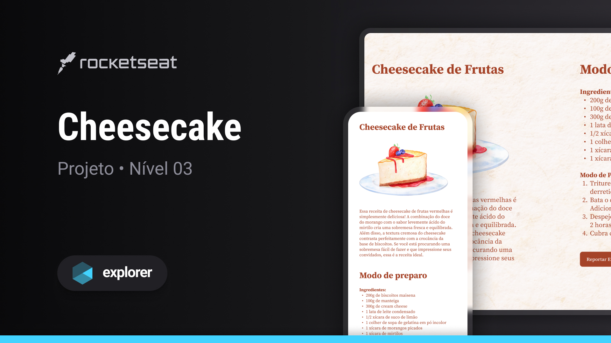

<h1 align="center"> Cheesecake </h1>

Programa exclusivo, promovido pela trilha Explorer da Rocketseat para ensino de tecnologias WEB. 

  <a href="#-tecnologias">Tecnologias</a>&nbsp;&nbsp;&nbsp;|&nbsp;&nbsp;&nbsp;
  <a href="#-projeto">Projeto</a>&nbsp;&nbsp;&nbsp;|&nbsp;&nbsp;&nbsp;
  <a href="#-layout">Layout</a>&nbsp;&nbsp;&nbsp;|&nbsp;&nbsp;&nbsp;
  <a href="#memo-licença">Licença</a>

  

 

  

## 🚀 Tecnologias

Esse projeto foi desenvolvido com as seguintes tecnologias:

- HTML e CSS
- Git e Github
- Figma

## 💻 Projeto

- 
O Cheesecake é uma aplicação web que apresenta a receita completa de um delicioso cheesecake de frutas vermelhas.  
 

- 
Programa tem por finalidade reforçar os conceitos de HTML e CSS, enfatizando a ideia de responsividade e regra mobile-first, adaptando o CSS para que a página carregada possa se adequar melhor aos diferentes tamanhos de tela dos dispositivos disponíveis, desde celulares e tablets a laptops e telas maiores.   

 - [Acesse o projeto finalizado, online](https://bernardosa01.github.io/Projeto-Cheesecake/)

## 🔖 Layout

Você pode visualizar o layout do projeto através [DESSE LINK](https://www.figma.com/community/file/1256354643188696521). É necessário ter conta no [Figma](https://figma.com) para acessá-lo.

## :memo: Licença

Esse projeto está sob a licença MIT.

---

Feito com ♥ por Bernardo Sá :wave: [Participe da comunidade da Rocketseat!](https://discord.gg/rocketseat)